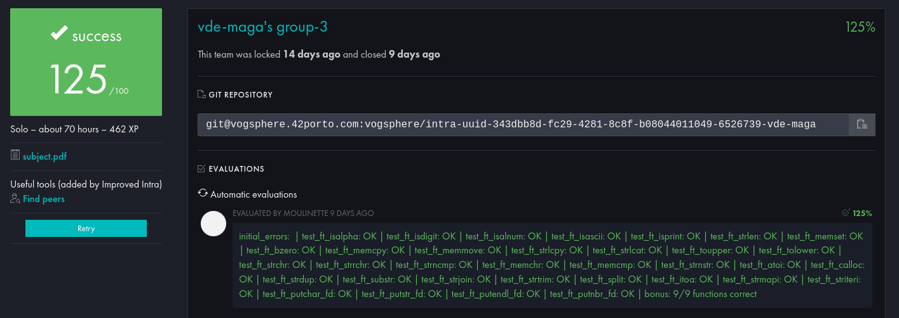

# 42 - libft

)

> Creating a Library in C

My resolution of the libft exercise from the 42 Porto school. This project aims to create a C library with functions that I can use in the future of the common core.

## Evaluation

## Topics

- C
- linked list
- malloc
- String manipulation

## Instructions

To compile my code, you can do `make` in the terminal. It will create the library, with the mandatory part of the project, and this project will be called `libft.a`.

To compile the bonus part, just use the bonus rule with `make bonus`. This will add the bonus functions.

You can also delete the objects created when generating the library with `make clean` and also delete the generated library and objects with the `make fclean` command.

In this project, I've also generated a header file, which contains all the prototypes of the functions created in this project. To use them, you can simply include the file `libft.h` with the command `#include “libft.h”` in your c code.
